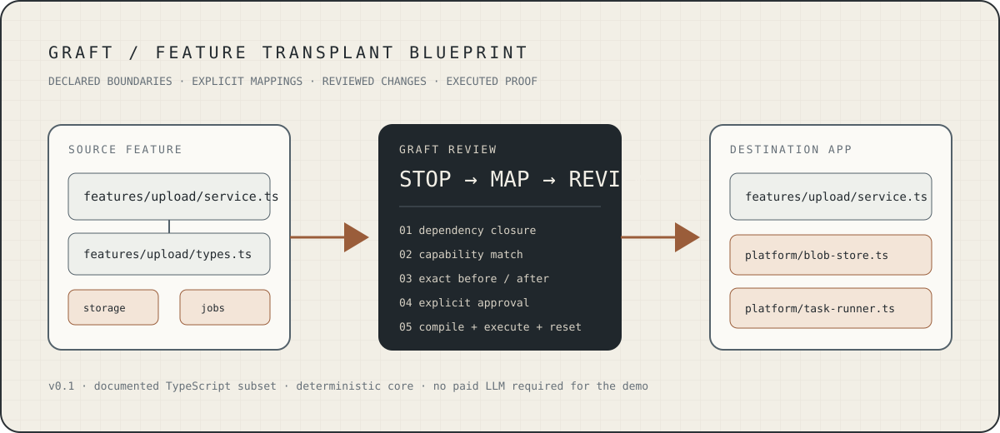
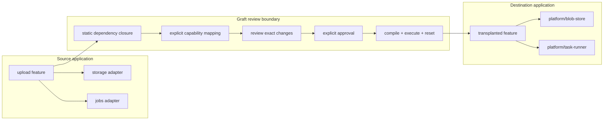
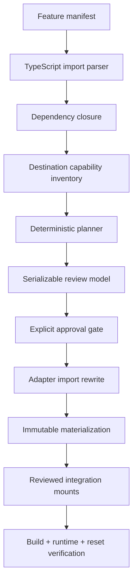

<p align="center">
  
</p>

<p align="center"><sub>Repository-owned concept diagram. Real application screenshots and a recorded demo will be added only after capture from the verified localhost flow.</sub></p>

# Graft

**Transplant an application feature without pretending copy/paste is integration.**

Graft v0.1 explores a narrow, testable workflow for moving a declared feature between compatible TypeScript applications with different internal structure. It discovers the supported static dependency slice, stops at declared infrastructure boundaries, maps those needs to capabilities the destination explicitly advertises, shows the exact change set for approval, applies only the reviewed plan, and verifies the resulting destination by compiling and executing it.

> **Scope, not magic:** Graft does not claim arbitrary cross-framework migration, undeclared runtime-dependency discovery, or semantic correctness from model confidence. The core demo does not require a paid LLM.

<table>
<tr><td><b>Source</b></td><td>Upload + processing + progress feature</td></tr>
<tr><td><b>Boundary</b></td><td>Declared storage and jobs adapters</td></tr>
<tr><td><b>Destination</b></td><td>Different module layout with compatible explicit capabilities</td></tr>
<tr><td><b>Review</b></td><td>Dependency graph, mappings, copies, rewritten imports, exact integration before/after</td></tr>
<tr><td><b>Proof</b></td><td>Strict compile, executable destination flow, clean reset/repeat, bounded localhost upload transport</td></tr>
</table>

## The demo in one picture



The source adapters are **not** copied. They are the boundary. Graft rewrites the transplanted feature to use destination modules selected through the reviewed capability mapping.

## Run it

Requires a recent Node.js runtime. The observed Linux development runtime is Node `22.16.0`; TypeScript is pinned to `5.8.3` in this repository.

```bash
npm install
npm test
```

Then choose the proof you want:

```bash
# deterministic CLI transplant → compile → execute → reset
npm run demo

# real bounded localhost HTTP upload around the compiled transplant
npm run demo:http

# localhost review + explicit approval console
npm run ui
```

The UI is read-only before approval. After the exact reviewed plan is approved, the server applies its server-owned prepared object, runs compile/runtime/reset verification, and provisions a short-lived upload demonstration.

## What is implemented

| Layer | v0.1 behavior |
| --- | --- |
| Feature contract | Versioned manifest with path/secret boundary validation |
| Dependency analysis | Static TypeScript ESM imports inside the supported subset |
| Unsupported edges | Dynamic/CommonJS/unknown dependencies are reported as blockers rather than omitted |
| Adapter boundary | Traversal stops at declared source capabilities |
| Destination inventory | Explicit capability contracts and destination module paths |
| Mapping | Deterministic compatible match; missing/ambiguous mappings block readiness |
| Change set | Reviewable copy targets, adapter bindings, and explicit integration mounts |
| Rewrite | Only declared adapter imports are rewritten, including relocation-safe relative specifiers |
| Apply | Stale source/destination inputs and hidden overwrites are rejected |
| Integration | Exact reviewed before/after patches at declared mount markers |
| Verification | Destination strict-compiles, executes, resets, recompiles baseline, and repeats |
| HTTP proof | Bounded raw text-like upload reaches the compiled transplanted service |
| Queue boundary | HTTP demo transport accepts with `202`, exposes explicit queued/running/complete/failed job state, and supports polling |
| Product UI | Local review console for graph, mappings, file changes, integration diff, approval, and post-approval upload proof |

## Evidence — what has actually been observed

The evidence is intentionally split between **complete-suite** and **newer focused** validation so the README never upgrades a result that was not run.

**Complete repository baseline:** at commit `98051d2`, strict build + the then-current suite completed with **39 passed / 0 failed**.

After that baseline, the project added real HTTP request handling, destination-owned content metrics/checksum processing, a token-gated browser upload path, and now an explicit in-memory async job/polling transport. Focused HTTP and review-server integration tests were observed passing before the latest queue refactor. For the queue refactor itself, a standalone localhost smoke test observed:

```text
POST /api/upload        -> 202 queued
GET  /api/jobs/:id      -> complete
feature invocation      -> received real request bytes
GET  /api/health        -> 0 active, 0 queued
```

**The full repository suite has not yet been rerun after the latest queue refactor.** Until that happens, `39/39` remains the latest complete-suite baseline rather than a claim about the current head.

See `.nightshift/STATE.json` for the exact handoff and `docs/verification/` for committed evidence snapshots.

## Review model

A prepared transplant exposes the things a reviewer actually needs to question:

```text
SOURCE
features/upload/service.ts
features/upload/types.ts
       │
       ├── storage  ──map──> platform/blob-store.ts
       └── jobs     ──map──> platform/task-runner.ts

DESTINATION CHANGE SET
+ features/upload/service.ts
+ features/upload/types.ts
~ entry.ts                exact reviewed integration mount
```

Approval is not “trust the AI.” The current core is deterministic. A plan can be ready only when its declared requirements resolve without blockers, and apply rechecks reviewed inputs so a changed destination cannot silently receive a stale patch.

<details>
<summary><b>Supported v0.1 subset</b></summary>

- TypeScript applications using supported static ESM imports.
- Feature boundaries declared in a versioned manifest.
- Explicit source adapter contracts.
- Explicit destination capability inventory.
- Deterministic import rewriting for declared adapter boundaries.
- Explicit destination integration mount markers.
- In-memory demo storage and transport queue for the runnable proof.

Not supported: arbitrary frameworks, hidden environment contracts, arbitrary dynamic imports, undeclared database/network dependencies, production deployment automation, or semantic equivalence claims across unrelated architectures.

</details>

## Why not just use packages, codemods, generators, or Module Federation?

Those are real, established solutions to adjacent problems. Graft is deliberately narrower than “code reuse.”

- **npm workspaces** manage and link local packages.
- **jscodeshift** runs codemods/source transforms.
- **Nx generators** create and update workspace files/configuration.
- **Webpack Module Federation** composes separately built modules at runtime.

Graft's experiment is the **reviewable feature-level application change** when behavior is embedded in a source app, the destination has different infrastructure modules, and the transplant must prove exactly what it mapped, changed, built, and executed.

Primary-source comparison and links: [`docs/REUSE-LANDSCAPE.md`](docs/REUSE-LANDSCAPE.md).

## Architecture



The localhost browser console renders the same prepared transplant used by apply; it does not submit a client-authored plan back to the server.

## Current limitations

- Destination storage in the authored demo is in-memory.
- The HTTP job queue is explicit and asynchronous but remains in-memory and non-durable.
- The destination task adapter computes its internal progress history in one process; a durable external worker is not claimed.
- Browser upload accepts bounded text-like content as a raw body; multipart/authentication are outside v0.1.
- Windows and CI execution are not yet claimed.
- Current support is the documented TypeScript subset only.

These are scope boundaries, not hidden TODOs. Unsupported imports, mappings, routes, schemas, and framework conventions should become visible blockers rather than silently disappearing.

## Repository map

```text
src/                    deterministic analysis / plan / apply core
demo/source-app/        source fixture with upload feature
demo/destination-app/   structurally different destination fixture
demo/                    compile/run/reset + HTTP proof harnesses
ui/                      localhost review/approval console
test/                    regression and integration tests
docs/verification/      recorded evidence snapshots
docs/REUSE-LANDSCAPE.md primary-source positioning
.nightshift/STATE.json  sprint handoff and evidence ledger
```

## Interview walkthrough

If you have five minutes to explain Graft:

1. **Show the problem:** moving a feature is more than copying the visible component; it drags backend logic, imports, infrastructure contracts, schemas/config, and integration points.
2. **Show the boundary:** Graft follows supported static dependencies but deliberately stops at declared infrastructure adapters.
3. **Show the mapping:** the destination advertises capabilities; Graft maps contracts or blocks on ambiguity/missing support.
4. **Show the review:** exact created files, rewritten adapter imports, destination integration before/after, and blockers are visible before approval.
5. **Show the proof:** approve, compile the resulting destination, send an upload through the transplanted feature, inspect processing/progress, reset, and repeat.
6. **Say what it is not:** not arbitrary framework translation and not AI confidence masquerading as correctness.

## Sprint direction

Next proof-oriented milestones:

- rerun the **entire** suite and `npm run demo:http` from a normal full checkout after the async queue refactor;
- move the browser upload onto the same visible queued-job/polling contract;
- capture real review → approval → upload screenshots and a short recording from that verified behavior;
- add those real assets to this README rather than fabricating product screenshots;
- continue hardening the supported contracts before broadening framework scope.

---

<p align="center"><b>Graft v0.1</b> · deterministic where it can be · blocked where it cannot prove support</p>
