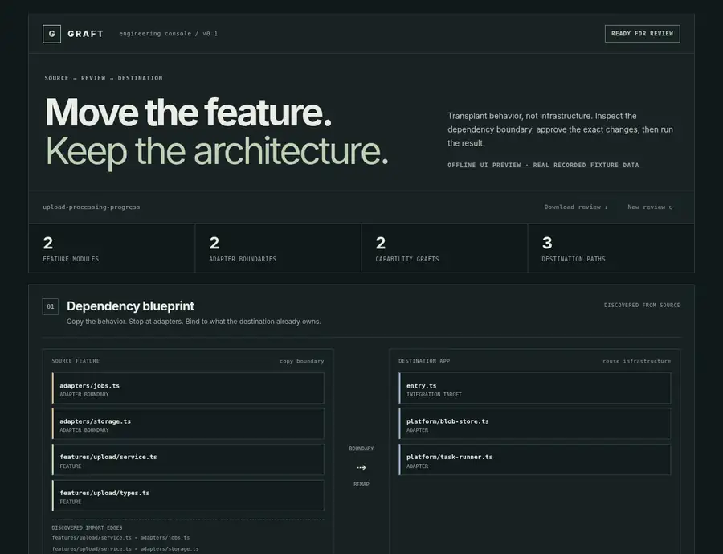
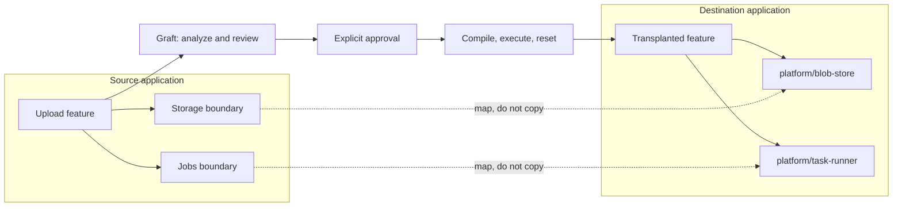
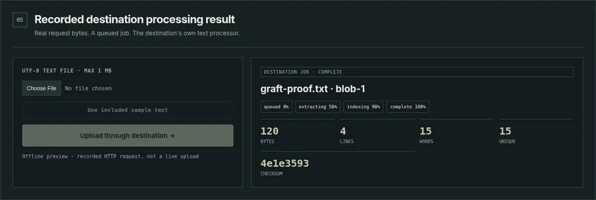
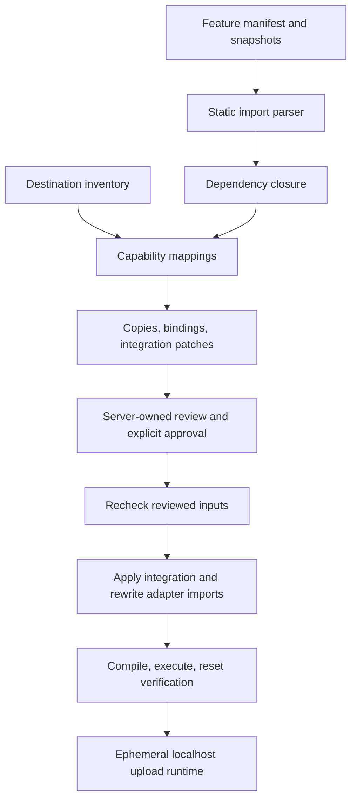

<p align="center"></p>

<p align="center"><b>Move the feature. Keep the architecture.</b><br><sub>TypeScript ESM · Explicit contracts · Human review · Executable proof</sub></p>

<p align="center">
  <a href="#run-it">Run it</a> · <a href="#the-transplant">The transplant</a> · <a href="#verified-evidence">Evidence</a> · <a href="#supported-not-magic">Supported scope</a>
</p>

---

Graft moves a **declared feature** between compatible TypeScript applications without copying the source application's infrastructure. It follows static imports, stops at adapter boundaries, maps destination capabilities, and presents the exact changes before approval. The authored demo then compiles, executes, uploads real text, and resets the destination to prove the workflow.

**v0.1 is a scoped engineering demonstrator—not a universal migration agent.** The core is deterministic and the demonstration requires no paid AI service.

## Inside the console



<sub>Offline preview of the shipped HTML, CSS, and rendering functions using recorded, successfully executed HTTP fixture data. This is not a live-browser screenshot. Live Chromium navigation was blocked by the execution environment; no policy bypass or live-browser pass is claimed. The opening blueprint is a concept illustration.</sub>

## The transplant

<table>
<tr><td><b>01 / Discover</b><br>Follow the supported import graph.</td><td><b>02 / Bind</b><br>Replace source adapter references with declared destination capabilities.</td></tr>
<tr><td><b>03 / Review</b><br>Inspect created files, mappings, and exact integration before/after.</td><td><b>04 / Prove</b><br>Approve, compile, execute, upload, poll, and reset.</td></tr>
</table>



The demonstration creates `features/upload/service.ts` and `features/upload/types.ts`, updates one explicitly marked integration point in `entry.ts`, and preserves the destination's existing application and adapters. Source adapters never cross the copy boundary.

## Use the result



<sub>Offline rendering of an actual recorded HTTP result, not a staged live upload. The checked-in sample produced 120 bytes, 4 lines, 15 words, and checksum <code>4e1e3593</code>. Processing history is displayed after completion; it is not a live stream of worker progress.</sub>

After approval, choose a UTF-8 text file or the included sample. The server accepts it with **`202 queued`**; polling returns the destination job's result. The demo uses the destination's own storage and text processor, not copied source infrastructure.

## Run it

Validated with **Node 22.16.0 on Linux** and the repository's pinned **TypeScript 5.8.3**. Access to this private repository is required.

```bash
git clone https://github.com/shlbi/graft.git
cd graft
npm install
npm test
npm run ui
```

Open the localhost address printed in the terminal. Review the mappings and integration diff, select **Approve & verify transplant**, then **Use included sample text** and **Upload through destination**.

```bash
npm run demo       # two complete compile / execute / reset cycles
npm run demo:http  # real HTTP upload -> queued job -> destination processing
```

**Download review** exports only the read-only model, without session authorization. **New review** starts another review after an error or expired runtime. Approval applies to the server-owned prepared object; the browser cannot submit arbitrary source code or a replacement transplant plan.

<details>
<summary><b>Reproduce the evidence and offline previews</b></summary>

```bash
npm run build
node scripts/capture-evidence.mjs
```

This starts a temporary loopback server, executes the actual review/approval/upload/poll/replay checks, closes the server, and saves `docs/verification/release-http-session.json`. The report intentionally excludes review IDs and upload authorization tokens.

The optional offline preview script requires Python, Playwright, Pillow, and an installed Chromium browser. It does not navigate to or proxy the running application:

```bash
python scripts/render-previews.py --chromium /path/to/chromium
```

It renders the shipped UI against the recorded HTTP report, labels the images as offline previews, and checks desktop/mobile layout. Running it is **not** a substitute for testing the live browser workflow.

</details>

## Verified evidence

| Check | Observed result |
| --- | --- |
| Strict TypeScript build + complete Node suite | **53 passed · 0 failed · 0 skipped** at `7e30b34` |
| Source and destination CLI | Source works; destination initially lacks the feature |
| Transplanted destination | Strict compilation and execution use destination adapters |
| Clean reset | Original baseline restored, recompiled, and repeated across two cycles |
| Actual HTTP review and approval | `200` for both; approval replay rejected with `404` |
| Actual upload | `202 queued`, token-gated polling, completed destination processing |
| Invalid UTF-8 | Rejected with `415`; no successful job claimed |
| Queue regression coverage | Receiving reservations, serial work, failure handling, accepted-job shutdown drain |
| Client controller | Four DOM-stub regressions; **not live-browser tests** |
| Offline visual checks | Seven dependency nodes; hidden pre-approval panels; no horizontal overflow at 1280px and 390px |
| Live browser / Windows / hosted CI | **Not verified** in this environment |

The complete result includes all current HTTP and review-server tests; it supersedes the earlier 39-test baseline. A release evidence summary and image provenance live in [`docs/verification/release.json`](docs/verification/release.json).

The release was tested from an exact connector-restored repository snapshot. The locally available compiler matched the pinned version; a fresh network dependency installation was not verified here.

## Supported, not magic

| Implemented | Deliberately not claimed |
| --- | --- |
| Versioned manifest and destination inventory | Automatic discovery of every hidden runtime requirement |
| Supported static TypeScript ESM import graph | Arbitrary frameworks, dynamic imports, or CommonJS migration |
| Explicit contract mapping and adapter import rewriting | Semantic compatibility based only on a matching contract label |
| Exact copy operations and marker-based integration patches | Heuristic edits to unknown production applications |
| Immutable preparation/apply with stale-input and overwrite guards | A security sandbox for executing untrusted repository code |
| Authored fixture console with real localhost text uploads | A general-purpose repository picker or production deployment tool |
| Bounded, serial, in-memory demo job queue | Durable storage, external workers, or crash recovery |

Bare package dependencies can be reported by analysis, but Graft does **not** resolve or install them. Database migrations, environment provisioning, arbitrary UI-framework transplantation, and production authentication are outside this release. The full upload demonstration covers the authored backend feature and its explicit integration point; it does not prove every part of the broader product vision.

## How it is built



<details>
<summary><b>Engineering decisions worth inspecting</b></summary>

**Explicit contracts over guessing.** Missing or ambiguous capabilities block a plan. Contract labels select candidate adapters; the compiler and runtime verify the authored fixture's compatibility.

**Review includes content preconditions.** Changes to reviewed source, destination adapters, or integration targets invalidate the prepared operation. Unrelated destination edits remain preserved.

**Separate copy boundaries from infrastructure.** The source service moves; destination storage and processing remain destination-owned. The tests distinguish these using different file IDs and progress histories.

**Bound receiving requests, not only completed uploads.** Queue reservations count bodies still arriving. Shutdown waits for accepted work, including jobs submitted in the same tick.

**Keep browser authority small.** The browser sends a one-time review ID and approval flag. Exported review JSON contains no upload token; local host/origin checks and an ephemeral token protect the demonstration boundary. This is not production authentication.

**Evidence has a scope.** Node HTTP integration, controller tests, offline rendering, and live-browser execution are separate checks. One cannot silently stand in for another.

</details>

## Repository map

```text
src/                   analysis, mappings, reviewed changes, rewrite and apply
demo/source-app/       authored source with upload feature
demo/destination-app/  distinct destination-owned storage and job adapters
demo/                  compile/run/reset, HTTP transport, bounded queue
ui/                    review, approval and upload console
test/                  regression, HTTP integration and controller tests
scripts/               build, tests, evidence capture and offline rendering
docs/assets/           repository-owned illustration and labeled previews
docs/verification/     release evidence and provenance
```

## Interview walkthrough

Start with the two different adapter implementations. Show that the source uses `upload-1` while the transplanted destination uses `blob-1`. Inspect the exact reviewed import replacements and integration patch. Run `npm test`, then demonstrate approval, a text upload, the destination metrics, and a clean reset. Explain why an explicit contract is helpful but insufficient without compilation and execution.

See [`docs/DEMO.md`](docs/DEMO.md) for the executable demo and [`docs/REUSE-LANDSCAPE.md`](docs/REUSE-LANDSCAPE.md) for primary-source context on packages, codemods, generators, and runtime composition. Graft does not claim to have invented code reuse.

## Release boundary

**Delivered:** the tested v0.1 engineering demonstrator, review console, reproducible proof, and visual documentation.

**Still outside the completed scope:** live-browser verification in an unrestricted development environment, broader application/framework support, durable storage/workers, and a production security review. Further expansion requires a separate development scope, not a claim that this demonstration already provides it.

AI-assisted implementation with explicit evidence and limitations. This private repository does not declare an open-source license.

---
<p align="center"><b>Behavior crosses the boundary. Infrastructure stays home.</b></p>
