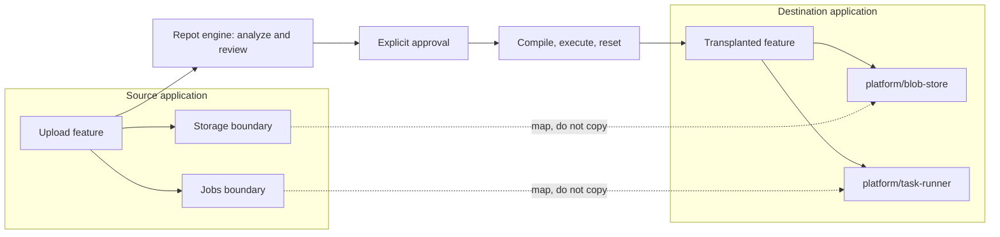
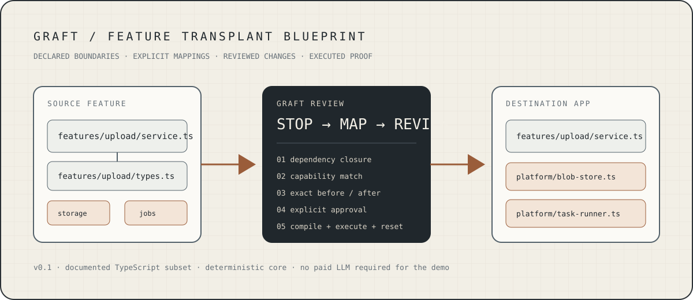
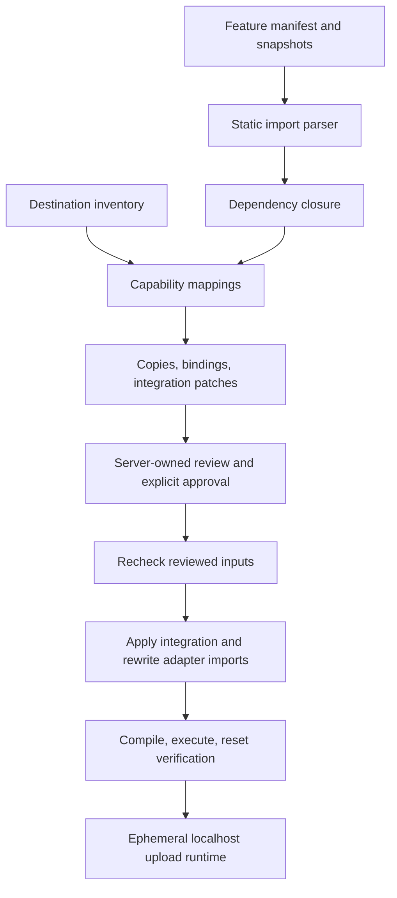

# Repot

### Good code. New ground.

**Move the feature. Keep the architecture.**

Point to two repositories, describe the behavior to move, and review a focused transfer with related tests. Keep the destination yours.

<p align="center">
  <a href="https://getrepot.com">Website</a> ·
  <a href="#mcp">MCP</a> ·
  <a href="#run-it">Run it</a> ·
  <a href="#the-transplant">The transplant</a> ·
  <a href="#verified-evidence">Evidence</a> ·
  <a href="#how-it-is-built">Architecture</a>
</p>


<sub>Repot redesign preview, rendered offline from the authored interface—not a hosted-product screenshot. The wireframe transplant is an illustration. See <a href="docs/REPOT-FRONTEND.md">image provenance and layout checks</a>.</sub>

**Product:** Repot · **Domain:** getrepot.com · **Repository:** `shlbi/graft`, retained for compatibility.

---

## The experience

A feature, not a fork. Repot selects source implementation and related tests, considers the destination's existing code, and presents exact changes before publication. The hosted MCP workflow creates a new `repot/*` branch and a **draft pull request**. It never silently merges or writes to the destination's default branch.

The redesigned interface pairs a restrained dark palette with structural rules, a wireframe transplant illustration, and a three-column review workspace. Its authored frontend uses native HTML, CSS, and JavaScript without third-party fonts, trackers, or UI libraries. Interactive anatomy tabs are illustrations, not fabricated analysis results.

This repository contains the **hosted, AI-assisted MCP workflow** and the **original deterministic TypeScript engine demonstration**. The demo's compile/execute/reset proof applies to its authored fixtures, not arbitrary external projects.

## MCP

Copy the remote endpoint into a compatible MCP client:

```text
https://mcp.getrepot.com/mcp
```

The client discovers Repot's OAuth server, the user signs in with GitHub, and an explicit consent step authorizes the client. The client receives a Repot-scoped token; GitHub credentials stay server-side. Sign-in uses the GitHub account identity, not the user's email address.

### One transfer, one resumable job

```text
Inspect the two repositories
    ↓
Start a draft → jobId
    ↓
Poll the same job → prepare → generate → validate
                                        ↳ repair within the saved budget
    ↓
Read the saved review → inspect the exact patch
    ↓
Explicitly publish → new branch + draft PR
```

| Tool | Responsibility |
| --- | --- |
| `repot_repositories` | List repositories available through the user's GitHub App connection. |
| `repot_inspect` | Discover feature, test, and destination context without AI or repository writes. |
| `repot_draft` | Save the transfer request and return a durable `jobId`. |
| `repot_draft_status` | Advance preparation, background submission, polling, and review finalization in bounded steps. |
| `repot_draft_cancel` | Record cancellation and attempt provider cleanup. |
| `repot_review` | Retrieve the exact owner-bound review and its validation results. |
| `repot_publish` | Publish an exportable, explicitly reviewed transfer as a draft PR; refuse a stale destination. |

New jobs support **one initial generation plus up to two targeted repairs**. A repairable problem returns “Adjusting the integration,” retaining the same feature and pinned snapshots. The client keeps polling the same job rather than substituting another feature. Each actual generation consumes the configured draft allowance. Legacy jobs without a repair budget remain single-attempt.

AI drafting requires explicit code-sharing and background-processing consent. Background mode temporarily retains response data at the provider for execution and polling; it is not zero retention. Reviews are encrypted and expire. An uncertain submission is not blindly repeated, and cancellation does not claim a deletion that could not be confirmed.

Read [resumable drafts](docs/ASYNC-DRAFTS.md), [bounded repairs](docs/DRAFT-REPAIRS.md), and [the production runbook](docs/PRODUCTION.md). The earlier [local stdio MCP](mcp/README.md) remains a development fallback, not the primary product.

## Run it

### Current Next.js app

The current package targets **Node.js 24.x**. Original engine evidence below was recorded on Node 22.16.0; those are separate environments.

```bash
git clone https://github.com/shlbi/graft.git
cd graft
npm install
npm run dev
```

Authentication and hosted drafting require the server-side configuration in [the production runbook](docs/PRODUCTION.md). Keep credentials out of source control and `NEXT_PUBLIC_` variables. Database migrations are explicit operator actions, not routine build steps; draft-job setup is covered in [resumable drafts](docs/ASYNC-DRAFTS.md#activation).

```bash
npm run build       # Sync public assets and build Next.js
npm start           # Run the built app
npm run test:frontend
npm run test:auth
npm run test:drafts
```

The redesigned workspace displays `FRONTEND PREVIEW` and disables repository actions when its session API is unavailable. A rendered interface is not proof that its backend is connected.

### Deterministic engine demo

The original demonstration requires **no paid AI service**. It uses pinned TypeScript 5.8.3 and authored source/destination fixtures.

```bash
npm test
npm run ui          # Local review, approval, and upload console
npm run demo        # Two compile / execute / reset cycles
npm run demo:http   # HTTP upload → queued job → destination processing
```

Open the localhost address printed by `npm run ui`. Review the mappings and integration diff, select **Approve & verify transplant**, then **Use included sample text** and **Upload through destination**.

The retained commands `npm run web`, `npm run connected`, and `npm run test:connected` serve the earlier development workflows. See [connected-service setup](web/connected/README.md); that service is separate from the Next.js production server.

## The transplant

The deterministic engine moves a **declared feature** between compatible TypeScript applications without copying source infrastructure. It follows supported static imports, stops at adapter boundaries, maps destination capabilities, and presents exact changes before approval.

<table>
<tr><td><b>01 / Discover</b><br>Follow the supported import graph.</td><td><b>02 / Bind</b><br>Map source adapters to declared destination capabilities.</td></tr>
<tr><td><b>03 / Review</b><br>Inspect files, mappings, and integration before/after.</td><td><b>04 / Prove</b><br>Approve, compile, execute, upload, poll, and reset the demo.</td></tr>
</table>


```mermaid
flowchart LR
  subgraph Source[Source application]
    F[Upload feature] --> S[Storage boundary]
    F --> J[Jobs boundary]
  end
  F --> R[Repot engine: analyze and review]
  R --> A[Explicit approval]
  A --> V[Compile, execute, reset]
  subgraph Destination[Destination application]
    T[Transplanted feature] --> B[platform/blob-store]
    T --> W[platform/task-runner]
  end
  V --> T
  S -. map, do not copy .-> B
  J -. map, do not copy .-> W
```

The demo creates `features/upload/service.ts` and `features/upload/types.ts`, updates one explicitly marked integration point in `entry.ts`, and preserves the destination's application and adapters. **Source adapters never cross the copy boundary.**

### Original engine blueprint



<sub>Original v0.1 blueprint, retained with its historical Graft branding. An architecture illustration, not a product screenshot or a universal compatibility claim.</sub>

### Use the result

After approval, upload a UTF-8 text file or use the included sample. The demo accepts it with **`202 queued`**; token-gated polling returns the destination job's result. Storage and text processing remain destination-owned.

The recorded sample produced **120 bytes, 4 lines, 15 words, and checksum `4e1e3593`**. These are authored-fixture results, not performance benchmarks. Processing history is displayed after completion, not streamed as worker progress.

**Download review** exports the read-only model without session authorization. **New review** starts another review after an error or expired runtime. Approval applies to a server-owned prepared object; the browser cannot substitute source code or a replacement plan.

## How it is built

### Hosted workflow

**Next.js/Vercel** serves the website, OAuth routes, and remote MCP. **Better Auth** handles identity and client authorization. **PostgreSQL** holds auth records, encrypted jobs/reviews, and usage counters. **GitHub App tokens** authorize repository access; the **OpenAI Responses API** generates proposals. Repot's deterministic checks validate those proposals and transfer supported tests before draft-PR publication.

Durable jobs separate generation from a single MCP request. The current [package scripts](package.json), [production runbook](docs/PRODUCTION.md), and [job/repair documentation](docs/DRAFT-REPAIRS.md) describe this architecture. The earlier frontend-only deployment notes describe the redesign milestone, not today's hosted service.

### Deterministic engine


```mermaid
flowchart TD
  M[Feature manifest and snapshots] --> P[Static import parser]
  P --> C[Dependency closure]
  I[Destination inventory] --> B[Capability mappings]
  C --> B
  B --> R[Copies, bindings, integration patches]
  R --> H[Server-owned review and explicit approval]
  H --> G[Recheck reviewed inputs]
  G --> A[Apply integration and rewrite adapter imports]
  A --> V[Compile, execute, reset verification]
  V --> U[Ephemeral localhost upload runtime]
```

<details>
<summary><b>Engineering decisions</b></summary>

**Explicit contracts over guessing.** Missing or ambiguous capabilities block a plan. Contract labels select adapters; compilation and runtime execution establish compatibility for the authored fixture.

**Content preconditions in every review.** Changes to reviewed source, destination adapters, or integration targets invalidate preparation. Unrelated destination edits remain preserved.

**Feature boundaries stay separate from infrastructure.** The service moves; destination storage and processing stay destination-owned. Different file IDs and processing histories make that distinction testable.

**Count receiving requests, not just completed uploads.** Demo queue reservations include bodies still arriving. Shutdown waits for accepted work, including same-tick submissions.

**Keep browser authority small.** The original console sends a one-time review ID and approval flag. Exported review JSON excludes upload tokens; local origin checks protect the demonstration. Production authentication is separate.

**Generation does not approve itself.** Deterministic checks enforce paths, provenance, budgets, destination preconditions, and supported test transfer. Bounded repairs address ordinary mistakes without weakening those checks.

**Evidence has a scope.** HTTP integration, controller tests, offline rendering, SDK integration, and live-browser execution are different checks. One cannot stand in for another.

</details>

## Verified evidence

These are **recorded milestones**, not a newly executed whole-repository test run or a coverage percentage.

| Recorded milestone | Observed result | Scope |
| --- | --- | --- |
| Original engine release at `7e30b34` | **53 passed · 0 failed · 0 skipped** | Strict TypeScript build and the then-current Node suite. |
| Repot frontend redesign | **26 passing tests** | Interaction, consent, presentation, stale-session cleanup, unavailable-backend handling, and asset allowlisting. |
| Bounded-repair publishing pass at `ab4ab74` | **142 passed · 0 failed · 0 skipped** | Draft/repair tests with simulated external services; 18 changed JavaScript files passed syntax checks. |

<details>
<summary><b>Original engine and HTTP proof</b></summary>

| Check | Recorded outcome |
| --- | --- |
| Source and destination CLI | Source works; destination initially lacks the feature. |
| Transplanted destination | Strict compilation and execution use destination adapters. |
| Clean reset | Baseline restored, recompiled, and repeated across two cycles. |
| HTTP review and approval | `200` for both; approval replay rejected with `404`. |
| Upload and polling | `202 queued`, token-gated polling, completed destination processing. |
| Invalid UTF-8 | Rejected with `415`; no successful job claimed. |
| Queue regressions | Receiving reservations, serial work, failure handling, accepted-job shutdown drain. |
| Client controller | Four DOM-stub regressions, not live-browser tests. |
| Offline visual checks | Seven dependency nodes; hidden pre-approval panels; no horizontal overflow at 1280px and 390px. |
| Live browser, Windows, hosted CI | Not verified in that release's environment. |

The 53-test release superseded the earlier 39-test baseline. It used a connector-restored snapshot and a local compiler matching TypeScript 5.8.3; fresh network dependency installation was not verified there.

</details>

The redesign's offline Chromium checks covered **1440, 1024, 390, and 320px** layouts, illustrative tabs, and data disclosure. HTTP browser navigation was blocked in that environment. The repair suite's external provider, PostgreSQL, MCP SDK, and test-transplant boundaries are simulated; its report does not claim a full local Next.js build or a live repaired transfer.

Records: [engine release](docs/verification/release.json) · [frontend report](docs/repot-frontend-verification.json) · [repair report](docs/verification/draft-repairs.json).

<details>
<summary><b>Reproduce the original evidence</b></summary>

The engine build is separate from today's Next.js build:

```bash
node scripts/build.mjs
node scripts/capture-evidence.mjs
```

The capture script starts a loopback server, executes review/approval/upload/poll/replay checks, closes it, and generates `docs/verification/release-http-session.json`. That generated report excludes review IDs and upload authorization tokens.

The optional historical preview renderer requires Python, Playwright, Pillow, and Chromium:

```bash
python scripts/render-previews.py --chromium /path/to/chromium
```

It renders authored UI against recorded HTTP data, not a live application. Those legacy console images are not displayed here. The Repot redesign's separate render is documented in [the frontend notes](docs/REPOT-FRONTEND.md).

</details>

## Supported, not magic

**Hosted MCP:** bounded repository snapshots, AI-assisted generation, supported test relocation, encrypted reviews, resumable jobs, bounded repairs, and explicit draft-PR delivery. It does **not** execute customer code: `build`, `tests`, and `integration` stay `not_run` until checked separately. Unsafe changes, missing inspected context, refusals, and unsupported test-transfer cases remain blockers. A structural pass is not a working-feature guarantee; see [release acceptance](docs/PRODUCTION.md#release-acceptance).

**Original deterministic demo:** a scoped TypeScript demonstrator, not a universal migration agent.

| Implemented | Deliberately not claimed |
| --- | --- |
| Versioned manifest and destination inventory | Discovery of every hidden runtime requirement. |
| Supported static TypeScript ESM import graph | Arbitrary frameworks, dynamic imports, or CommonJS migration. |
| Explicit contracts and adapter import rewriting | Semantic compatibility from a matching label alone. |
| Exact copies and marker-based integration patches | Heuristic edits to unknown production applications. |
| Immutable preparation/apply with stale-input and overwrite guards | A sandbox for untrusted repository code. |
| Authored fixtures with real localhost text uploads | Universal repository or production-deployment support. |
| Bounded serial in-memory demo queue | Durable demo workers or crash recovery; hosted jobs are separate. |

The engine reports bare package dependencies but does not resolve or install them. Environment provisioning, database migrations, arbitrary UI-framework transplantation, and production authentication are outside that original demonstration. Its proof covers the authored backend feature and explicit integration point.

## Repository map

```text
app/                   Next.js website, OAuth, consent, and remote MCP routes
remote/                authentication, GitHub delegation, encrypted jobs/reviews, repairs
web/lib/               bounded analysis, validation, test transfer, AI requests
web/connected/public/  Repot interface, brand assets, and MCP documentation
mcp/                   local stdio MCP development fallback
src/                   deterministic analysis, mappings, rewrite, and apply
demo/source-app/       authored source with upload feature
demo/destination-app/  destination-owned storage and job adapters
demo/                  compile/run/reset, HTTP transport, bounded demo queue
ui/                    original local engine console
test/                  engine regressions, HTTP integration, controller tests
remote/test/           authentication, jobs, repairs, provider-contract tests
scripts/               builds, operator migrations, tests, evidence capture
docs/assets/           repository-owned redesign preview and original blueprint
docs/verification/     scoped execution records and image provenance
```

## Documentation

[Production setup](docs/PRODUCTION.md) · [GitHub identity](docs/GITHUB-IDENTITY.md) · [OAuth continuation](docs/OAUTH-CONTINUATION.md) · [Auth troubleshooting](docs/AUTH-TROUBLESHOOTING.md) · [Resumable drafts](docs/ASYNC-DRAFTS.md) · [Bounded repairs](docs/DRAFT-REPAIRS.md) · [Executable demo](docs/DEMO.md) · [Code-reuse landscape](docs/REUSE-LANDSCAPE.md) · [Frontend design](docs/REPOT-FRONTEND.md).

The product overview and former engine README are consolidated here. Historical evidence retains its original scope. Reuse source code only with permission; preserve its license and attribution.

---

<p align="center"><b>Behavior crosses the boundary. Infrastructure stays home.</b></p>
