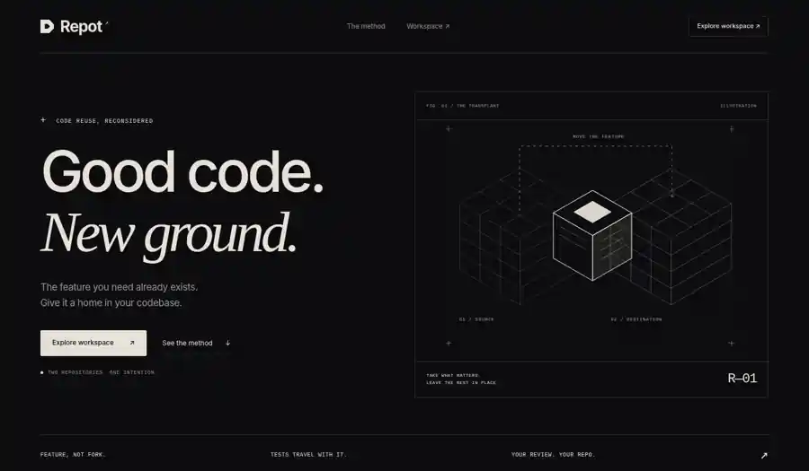

# Repot

### Good code. New ground.

Move a feature between codebases. Keep the destination yours.



<sub>Offline rendering of the authored interface, not a hosted-product screenshot. The wireframe diagram is an illustration. No customer data, invented test results or fabricated adoption metrics are displayed.</sub>

**Product:** Repot · **Domain:** getrepot.com · **Repository:** shlbi/graft (retained for compatibility)

## The experience

Point to a source and destination repository, describe the behavior to move, and inspect a focused proposal with related tests. The connected beta supports human-authorized draft PR delivery. It does not silently merge or write to the destination's default branch.

The redesigned frontend is intentionally restrained: obsidian `#0D0D0F`, bone `#E7E1D8`, structural rules, a wireframe transplant illustration, and a three-column review workspace. It uses native HTML, CSS and JavaScript, with no third-party fonts, trackers or UI dependencies. Interactive anatomy tabs are labeled illustrations, not analysis results.

## Run the frontend

Node.js 22 or newer; no dependency install is needed for the static frontend build or frontend tests.

```sh
npm run test:frontend
npm run build:site
```

The build creates `.repot-site/` containing only `index.html`, `style.css`, and `app.mjs`. Serve that directory with a local static server to inspect the site. `vercel.json` selects this same build and output directory; the legacy TypeScript build is deliberately not used as a website build.

**A static deployment is not the connected backend.** When the session API is unavailable, the UI shows `FRONTEND PREVIEW`, disables repository actions, and does not link users into a broken sign-in flow. There is no fallback that claims authentication, generates fake jobs, or uploads code elsewhere.

## Run the connected beta

Follow [the connected-service setup](web/connected/README.md). It still requires server-side App credentials, invited users, encrypted persistent storage and an appropriately configured host. `GRAFT_*` environment variables, API routes, cookie names and branch prefixes remain unchanged to avoid breaking existing integrations.

**The SQLite/in-process backend has not been migrated to Vercel Functions.** Hosting the new frontend does not close that engineering gap. Live GitHub OAuth/PR testing, the isolated verifier for user projects, and public release security checks remain open.

## Validation

The rebrand added/updated **26 passing frontend tests** for interaction contracts, consent gates, code-as-text rendering, patch bytes, stale-session cleanup, unavailable-backend handling, build allowlisting and presentation structure. This is a focused frontend result, not a new whole-repository coverage claim.

Offline Chromium rendering checked 1440, 1024, 390 and 320px layouts without horizontal overflow, and exercised the illustrative tabs and data disclosure. HTTP browser navigation was blocked by the execution environment. No live OAuth, paid inference or user-repository verification was performed for this redesign.

See [design and verification notes](docs/REPOT-FRONTEND.md) and [machine-readable evidence](docs/repot-frontend-verification.json).

## Existing engineering work

The deterministic transfer engine, original local preview, synthetic acceptance fixtures and earlier evidence are preserved. The former root README is retained unchanged as [README-ENGINE.md](README-ENGINE.md), including its historical Graft branding. Existing commands (`npm test`, `npm run web`, `npm run connected`, `npm run test:connected`) remain available.

A reviewed draft is not a verified integration. Runtime checks in the original synthetic scenarios do not prove that arbitrary users' projects have been tested.
