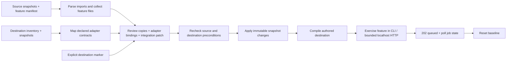

# A transplant you can compile, run, review, and exercise over HTTP

Graft's executable acceptance demonstration moves a two-module upload service
between checked-in TypeScript fixtures. It discovers the feature closure,
rewrites infrastructure imports to explicit destination capabilities, can mount
the feature at a reviewed marker, compiles the resulting destination, executes
it, and resets the temporary workspace. A localhost review console exposes the
real graph, mappings and exact before/after integration patch before approval.

The repository also includes a bounded HTTP proof: a real POST body is accepted
with `202` into an explicit in-memory demo job queue, then delivered to the
**compiled transplanted service**. The destination blob adapter stores the
payload and the destination task adapter computes actual byte/line/word,
unique-word and deterministic checksum metrics. Job state is pollable as
`queued`, `running`, `complete`, or `failed`.

This makes the queue boundary visible instead of holding the upload request open
through processing. It is still a demo queue: storage and job state are
in-memory, and no durable/background worker system is claimed.

## Run it

Use Node 22.16 or a compatible newer Node 22 release, then from the repository root:

```sh
npm install --ignore-scripts
npm test
npm run demo
npm run demo:http
npm run ui
```

The only package dependency is the pinned TypeScript compiler. No API keys,
paid model inference or external service is required. Build and test orchestration
use Node filesystem/process APIs rather than shell-specific cleanup or globbing.
Verification so far is on Linux; Windows is not claimed as tested.

All transplant execution uses owned temporary directories and removes them in
`finally`. Checked-in fixture folders are not modified by the demo runner.

## What is actually verified

| Stage | Observable result |
| --- | --- |
| Source compile and execution | `upload-1`, progress `0 → 35 → 75 → 100` |
| Destination before transplant | `hasUploadFeature: false` |
| Review console | Real dependency edges, adapter mappings, copy targets and exact integration before/after |
| Combined apply | Two feature files created; explicit entry point update when mounted; source adapters not copied |
| Destination after transplant | `blob-1`, destination progress `0 → 50 → 90 → 100` |
| HTTP acceptance | Bounded localhost POST accepts real request bytes with `202 queued` |
| HTTP job state | `GET /api/jobs/:id` exposes queued/running/complete/failed state |
| Destination processor | Reads stored content and computes byte/line/word/unique-word/checksum metrics |
| Preservation | Unrelated destination modules remain byte-for-byte unchanged by transplant application |
| Reset | Transplanted and emitted files disappear; original destination recompiles and reports feature absent |
| Repeat | Clean cycles produce the same destination-specific result |

Different IDs and progress values are deliberate fixture instrumentation: they
make accidental reuse of source infrastructure detectable. The progress numbers
are **not** measured production job progress or performance benchmarks.

The most recent complete repository-wide execution before the HTTP additions
passed **39 tests with zero failures**, including strict TypeScript compilation,
the executable transplant and the localhost approval flow. Focused HTTP and
review-server integration tests were observed after those additions but before
the latest queue refactor. The queue refactor itself has a standalone localhost
smoke pass. A new complete baseline must wait until `npm test` and
`npm run demo:http` are rerun together from a normal full checkout.

## Review and application flow



`prepareDemoTransplant({ integrate: true })` opts into the entry-point mount.
The default remains copy-only. Graft does not infer arbitrary route or lifecycle
locations: integration is an explicit reviewed patch with an exact marker.

After review, `applyPreparedTransplant` rechecks source content, required
destination adapters and integration targets. Stale input, missing adapters,
ambiguous markers and copy collisions stop application; unrelated destination
edits are preserved. The apply result distinguishes created, updated and
preserved files.

## Boundaries that matter

A matching contract name is an explicit declaration, not semantic proof. The
compiler and executable assertions establish compatibility only for these
fixtures. External packages are not installed by transplantation and undeclared
runtime/configuration dependencies are not magically discovered.

Prepared plans are trusted in-process objects, not signed authorization tokens.
The browser approval endpoint applies the exact server-owned prepared object;
it does not accept a client-supplied serialized plan as write authorization.

The temporary workspace validates paths/content before replacement, stages
writes and serializes apply/reset/read/close operations. It is **not** an OS
sandbox or permission to execute arbitrary third-party scripts. Compilation and
execution in these demos are limited to checked-in authored fixtures with finite
timeouts.

The HTTP demo deliberately keeps transport separate from transplant semantics.
It accepts a raw bounded body and a plain filename, rejects traversal-style
names and cross-origin browser writes, then places accepted work into a bounded
in-memory queue. Polling exposes queue state until the injected compiled feature
returns. Multipart parsing, authentication, durable object storage and a durable
worker queue remain outside this checkpoint.

The browser review console already exposes a post-approval token-gated upload
path, but that route still waits directly for the compiled feature result. The
next UI step is to put that browser path on the same explicit queued-job/polling
contract as `npm run demo:http` so the product visibly demonstrates the boundary.

## Next product milestone

First rerun the complete suite and `npm run demo:http` from a normal full
checkout after the queue refactor. If green, move the review-console upload onto
the same queue/polling contract, then capture real review → approval → upload
screenshots and a short demo recording. README media must come from that working
path; no invented screenshots or synthetic success state.
