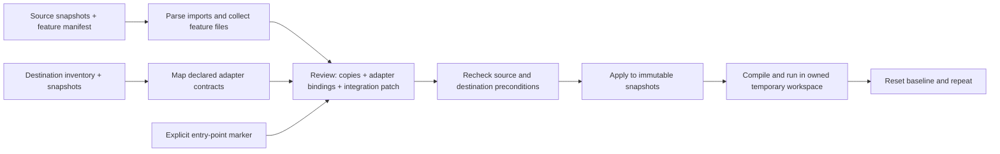

# A transplant you can compile, run, and reset

Graft's first executable acceptance demonstration moves a two-module upload
service between the checked-in TypeScript fixtures. It rewrites the service's
infrastructure imports, mounts it into the destination entry point, compiles
that complete destination, executes it, and resets the temporary workspace.
The verification repeats twice with fresh Node processes.

**Scope:** these are authored CLI fixtures with in-memory storage and simulated
job progress. This is not yet a browser upload, durable queue, real document
processor, database migration, or support for arbitrary application frameworks.

## Run it

Use Node 22.16 or a compatible newer Node 22 release, then from the repository root:

```sh
npm install --ignore-scripts
npm test
npm run demo
```

The only package dependency is the pinned TypeScript compiler. No API keys,
paid model inference, external service or globally installed TypeScript compiler
is required after installation. Build and test orchestration use Node filesystem
and process APIs rather than Unix-only removal commands or shell glob expansion.
Actual verification so far is on Linux; Windows is not claimed as tested.

The demo creates its own temporary directories and removes them in `finally`.
It does not transplant into or modify the checked-in fixture folders.

## What is actually verified

| Stage | Observable result |
| --- | --- |
| Source compile and execution | `upload-1`, progress `0 → 35 → 75 → 100` |
| Destination before transplant | `hasUploadFeature: false` |
| Combined review | Two file creations, one explicit entry-point update, two adapter bindings |
| Destination after transplant | `hasUploadFeature: true`, `blob-1`, progress `0 → 50 → 90 → 100` |
| Preservation | Destination app module, blob store and task runner retain exact original content |
| Reset | Transplanted source and compiled output disappear; original destination recompiles and reports `false` |
| Repeat | A second clean cycle produces the same destination-specific result |

Different IDs and progress values are deliberate fixture instrumentation: they
make accidental reuse of the source infrastructure detectable. Those numbers
are **not** measured production job progress or performance benchmarks.

The executed report is saved in
[`verification/2026-09-20-cli-demo.json`](verification/2026-09-20-cli-demo.json).
Run the command yourself to generate current evidence. This report is a dated
snapshot, not a live CI badge. At this checkpoint `npm test` passed **37 tests**
with zero failures, including the strict core compilation and complete demo.

## Review and application flow



`prepareDemoTransplant({ integrate: true })` opts into the entry-point mount.
The default remains a copy-only review for existing callers. The mount inserts
an import and invocation at the exact declared marker; it does not infer where
arbitrary application routes or lifecycle hooks belong.

`prepareTransplant` returns the combined list of touched targets and exact
integration before/after content. After the caller reviews the plan,
`applyPreparedTransplant` rechecks source content, required destination adapters,
and integration targets. Stale input, missing adapters, ambiguous markers and
copy collisions stop application; unrelated destination edits are preserved.
The apply result distinguishes created, updated, and preserved files.

## Boundaries that matter

A matching contract name is an explicit declaration, not proof of semantic
compatibility. The compiler and executable assertions establish compatibility
for these fixtures. External packages are not installed by transplantation;
undeclared configuration and runtime dependencies are not discovered magically.

Prepared plans are trusted in-process objects, not signed authorization tokens.
Do not accept a client-supplied serialized plan as permission to write files.

The workspace validates all snapshot paths and contents before replacing its
files, stages replacements, and serializes apply/reset/read/close operations.
It only manages a private temporary directory that it created. This is **not**
an OS sandbox, a crash-safe production transaction, or permission to execute
third-party source code. Compilation and execution in this runner are restricted
to the checked-in authored fixtures and have finite subprocess timeouts.

## Next product milestone

Expose the actual review, mappings, changed source and verification results in a
local UI. Then add real browser upload and asynchronous processing adapters,
with separate integration evidence. Product screenshots and README demo footage
must come from that functioning interface, not from invented UI mockups.
