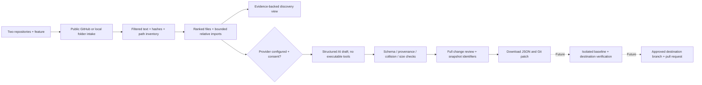

# Graft / Web preview

**Two repositories. One feature. A reviewable change set.**

This is the new product-facing workflow, alongside the unchanged v0.1 TypeScript engineering demonstrator in the repository root. It is a **local web preview**, not a hosted service or a universal verified transplant engine.

## Start

Requires Node.js 22 or newer and Git for the patch-execution tests. The web runtime has no third-party npm dependencies and needs no build step.

```sh
cd web
npm start
```

Open `http://127.0.0.1:4318`. Click **Try the sample** for an authored CSV transfer, or choose two local project folders, describe a feature, and click **Find my feature**. Public GitHub URLs are also implemented; external GitHub reads could not be exercised in this session because outbound DNS failed.

```sh
npm test
npm run check
```

The optional browser smoke test needs Python, Pillow, Playwright, and an installed Chromium:

```sh
python test/browser_smoke.py
```

The script starts and stops its own local server, never inherits an AI API key, exercises the real HTTP app, and captures screenshots only after actual browser navigation succeeds. It currently hits `ERR_BLOCKED_BY_ADMINISTRATOR` in the development sandbox. **No passing live-browser result or screenshot is claimed.**

## One workflow, explicit evidence

Choose a source and destination via a public GitHub URL or local folder. Describe behavior rather than assembling a manifest. Graft fingerprints the selected snapshots, ranks likely source files, expands bounded literal relative imports, and shows the files actually inspected. No source code is installed or executed.

Without an API key this produces **discovery**, not a speculative transfer. The sample produces a real deterministic patch from original synthetic fixtures and clearly identifies itself as authored, not AI-generated.

With an explicitly enabled provider, Graft requests an adapted draft, validates its structure and source provenance, shows the complete changed files, and offers a review JSON plus a unified Git patch. Existing destination content must have been included in the context before it can be updated. Proposed additions cannot overwrite known files or collide with file/directory paths. Changes never apply to your repositories automatically.

A structural pass means valid paths, provenance, size, collision, and snapshot checks. It **does not mean** the patch builds, its dependencies are complete, or its behavior is correct. Those statuses remain `not_run` in both the API and interface.

## Optional AI configuration

Configure `OPENAI_API_KEY` and `GRAFT_AI_MODEL` in the local server environment, then restart the server. Use a model available to your account that supports structured outputs in the Responses API. There is deliberately no default paid model and no browser-side API-key field.

Enable AI in the form and explicitly consent to sending selected source text from both projects to OpenAI for that request. The provider adapter makes one request, with no tool execution, no automatic retry or repair loop, `store: false`, and a 12,000-output-token limit. Refusals, incomplete output, malformed JSON, unsafe paths, unavailable destination context, and zero-change drafts stop the request.

Token limits are not a dollar budget. Configure account-level spending controls before supplying a key. Cancellation aborts the local/upstream request when possible but cannot guarantee zero billing after a request has already started. `store: false` is not a guarantee of zero provider-side retention; consult the provider's applicable data controls.

The adapter was tested against controlled responses. **No live paid inference call, model-quality benchmark, or provider latency claim was made in this release.**

## Boundaries and privacy

This server binds only to `127.0.0.1`. Exact Host/Origin checks, a restrictive CSP, response-size limits, request deadlines, and a two-job concurrency cap protect the local preview. There are no multi-user sessions, public registration, durable jobs, or tenant isolation. **Do not expose this server directly to the public internet.**

Folder inputs filter excluded files before upload; the server repeats its validation. Typical credential paths, dependency artifacts, binary/oversized content, and common credential-shaped strings are excluded. This is a conservative filter, not comprehensive secret detection. Inspect your selection and use code you have permission to share and reuse. Preserve licenses and attribution.

Public GitHub intake only requests allowlisted GitHub API paths, disables redirects, pins the default branch to a commit/tree/blob snapshot, skips symlinks/submodules for content, and rejects truncated trees. It reads up to 14 text blobs per repository. Other files remain in the collision inventory but are not understood. GitHub authentication and private-repository URL access are not implemented; local folders are the private-code route for this preview.

Supported *intake* includes text from JavaScript/TypeScript, Python, Go, Rust, Java, C#, Swift, C/C++, Ruby, PHP and common web/configuration formats. This does not imply semantic analysis or verified transformation support for every language or framework. Code that crosses database, build-system, infrastructure, binary-asset or service boundaries needs further integration work.

## Validation observed in this session

39/39 Node tests passed with zero failures, skips or cancellations. The suite covers normalization, filtering, snapshot hashes, ranking, language detection, context limits, provider schema and consent, collision guards, real HTTP endpoints, concurrency/cancellation, and the actual frontend controller using explicit DOM stubs.

The authored sample's patch passed `git apply --check`, applied to a temporary destination, preserved the unrelated README and original `taskCount` behavior, and executed `exportTasks` correctly for quoted/comma-containing cells and a formula-like string. Separate patch tests covered missing final newlines, empty baselines, CRLF and empty updated content. These are sample-specific checks, not blanket validation of generated drafts.

Syntax checking passed. Browser navigation was blocked by administrator policy. Outbound GitHub DNS returned `EAI_AGAIN`. The root v0.1 53-test suite was not re-run; its code, configuration and tests were not modified by this preview.

## Architecture



`lib/` owns intake, analysis, provider policy and patch validation. `server.mjs` provides the local HTTP boundary. `public/` contains the actual native-ESM UI. `test/` separates model/provider/HTTP/controller tests from the independently runnable browser test. The v0.1 engine is preserved; its adapter-aware transformation is not yet wired into this general-repository preview.

See [the product contract and next release gates](docs/PRODUCT.md) and [the exact validation record](docs/verification.json).

### Primary technical references

- [OpenAI structured outputs](https://developers.openai.com/api/docs/guides/structured-outputs)
- [GitHub Git trees, limits and truncation](https://docs.github.com/en/rest/git/trees)
- [GitHub App permissions](https://docs.github.com/en/apps/creating-github-apps/registering-a-github-app/choosing-permissions-for-a-github-app)

Consulted September 22, 2026. Do not treat this preview's successful structural validation as a model accuracy claim.
